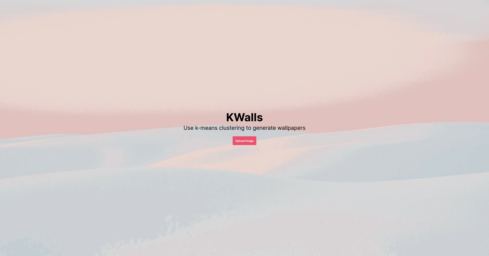
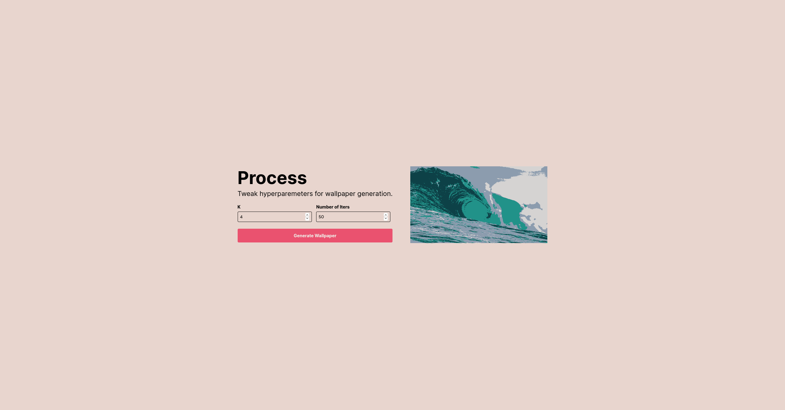

# KWalls
A nice little gatsby app to generate k-means based walllpapers. Right now uses crappy Lloyd's algorithm, and runs on browser-side JS. Probably works decently-ish only with smaller (<500px by 500px) images.

Who cares, it was nice practice with Framer transitions.

## Screenshots

